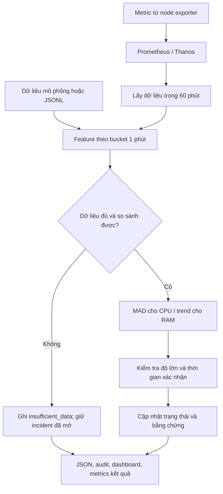

# Hiểu kế hoạch phát hiện bất thường tài nguyên: mục đích, lý thuyết và thuật toán

**Mục đích của kế hoạch là phát hiện những thay đổi đáng chú ý trong cách một máy hoặc dịch vụ sử dụng tài nguyên, giải thích vì sao chúng đáng chú ý, rồi cung cấp bằng chứng để quyết định có cần xử lý hay không.**

Ví dụ: một máy thường dùng 2% CPU bỗng dùng 40% trong nhiều phút. Máy chưa chạm ngưỡng 85%, nhưng hành vi đã thay đổi đáng kể. Ta muốn biết việc đó sớm để kiểm tra: có tăng traffic, chạy batch, deploy mới, hay xuất hiện vấn đề?


## Cách đọc
- **Lượt đầu để hiểu mục đích:** mục 1, 3, 5, 8, 12 và 16. Trong đó, mục 8 giải thích trọn vẹn một cảnh báo CPU bằng số cụ thể.
- **Lượt sau để hiểu thuật toán:** mục 4, 6, 7, 9, 10, 11 và 13. Sau đó đọc mục 14–18 để biết cách đánh giá, áp dụng và giới hạn.

Mục lục:

1. [Bài toán thực sự cần giải quyết](#muc-dich)
2. [Những khái niệm cần biết](#khai-niem)
3. [Toàn bộ hệ thống hoạt động như thế nào](#luong-xu-ly)
4. [Từ metric thô thành con số có ý nghĩa](#chuan-hoa)
5. [Vì sao dùng cửa sổ 60 phút, chia 50 và 10](#cua-so)
6. [Median và MAD: đo mức khác thường](#mad)
7. [Xác nhận theo thời gian: một điểm lạ đã đủ chưa](#xac-nhan)
8. [Ví dụ CPU-01 từ đầu đến cuối](#vi-du-cpu)
9. [Trend: phát hiện RAM tăng kéo dài](#trend)
10. [EWMA: phát hiện mức sử dụng mới hình thành](#ewma)
11. [Kết hợp tài nguyên, áp lực và ảnh hưởng dịch vụ](#ket-hop)
12. [Vòng đời cảnh báo và cách phục hồi](#trang-thai)
13. [Các thuật toán và phép tính mở rộng](#mo-rong)
14. [Mỗi rule trong kế hoạch phục vụ việc gì](#danh-muc)
15. [Cách chọn ngưỡng và kiểm chứng chất lượng](#kiem-chung)
16. [Cách áp dụng mà không cần hiểu hết mã nguồn](#ap-dung)
17. [Những hiểu nhầm và giới hạn cần nắm](#gioi-han)
18. [Liên hệ với mã nguồn và bước phát triển tiếp theo](#ma-nguon)
19. [Nguồn lý thuyết và tài liệu liên quan](#tai-lieu)

<a id="muc-dich"></a>

## 1. Bài toán thực sự cần giải quyết

### 1.1. Ngưỡng cố định trả lời được một phần câu hỏi

Giả sử đã có cảnh báo `CPU > 85%`.

| Tình huống minh họa | Ngưỡng 85% có phát hiện không? | Điều còn muốn biết |
| --- | --- | --- |
| CPU từ 2% lên 40%, giữ nhiều phút | Không | Vì sao cách sử dụng CPU thay đổi lớn? |
| CPU từ 80% lên 90% | Có, nếu đủ thời gian xác nhận | Có nghẽn hoặc ảnh hưởng dịch vụ không? |
| CPU thường dao động 30–60%, hiện là 45% | Không | Có thể đây là hoạt động bình thường |
| RAM tăng dần 30% → 42% trong nửa giờ | Không, nếu chỉ cảnh báo gần hết RAM | Có quá trình nào đang tích lũy bộ nhớ? |

Kế hoạch bổ sung khả năng so sánh **hiện tại với hành vi gần đây của chính đối tượng đó**. Máy A được so với lịch sử máy A; không mặc định mức CPU bình thường của máy B cũng phù hợp với máy A.

### 1.2. Có ba câu hỏi khác nhau

| Câu hỏi | Bằng chứng điển hình | Kết luận có thể đưa ra |
| --- | --- | --- |
| Hành vi có khác gần đây không? | CPU lệch baseline, RAM có trend tăng | Có thay đổi cần xem xét |
| Hệ thống có đang thiếu hoặc tranh chấp tài nguyên không? | Pressure, throttling, queue, bộ nhớ khả dụng thấp | Có dấu hiệu áp lực tài nguyên |
| Người dùng hoặc dịch vụ có bị ảnh hưởng không? | Latency, error, timeout, vi phạm SLO | Có bằng chứng ảnh hưởng dịch vụ |

**Bất thường thống kê, áp lực tài nguyên và sự cố dịch vụ là ba khái niệm cần đánh giá riêng.** CPU tăng có thể đến từ thêm người dùng, một công việc hợp lệ hoặc lỗi. Chỉ nhìn đường CPU chưa thể chọn được nguyên nhân.

Phần hiện đã triển khai chủ yếu trả lời câu hỏi thứ nhất. Hai câu hỏi tiếp theo cần thêm metric và mapping đúng giữa máy, workload và dịch vụ.

### 1.3. Đầu ra hữu ích phải dẫn đến việc kiểm tra cụ thể

Một kết quả hữu ích nên diễn đạt được:

> CPU của node A tăng từ mức nền 2% lên khoảng 40%. Ba trong năm phút gần nhất vượt điều kiện phát hiện. Dữ liệu đủ chất lượng. Chưa có bằng chứng về ảnh hưởng SLO; cần đối chiếu traffic, deploy và áp lực CPU.

Thông tin này giúp người vận hành thu hẹp việc cần kiểm tra. Chương trình không tự restart dịch vụ, scale máy hoặc khẳng định một process nào là thủ phạm.

<a id="khai-niem"></a>

## 2. Những khái niệm cần biết

| Thuật ngữ | Cách hiểu trong dự án | Ví dụ |
| --- | --- | --- |
| Metric | Đại lượng đo được | Số giây CPU idle, số byte RAM khả dụng |
| Sample | Một lần ghi nhận giá trị tại một thời điểm | Bộ đếm idle tại 13:57:05 |
| Time series | Dãy sample của cùng một metric và bộ label | CPU idle của core 0 trên node A |
| Entity | Đối tượng được đánh giá riêng | Một node, device hoặc service |
| Label | Thuộc tính xác định series | `cluster`, `job`, `instance`, `cpu` |
| Feature | Đại lượng đã chuẩn hóa để đưa vào thuật toán | CPU sử dụng 40% trong một bucket |
| Bucket | Khoảng thời gian gom mẫu | `[13:57, 13:58)` |
| Baseline | Nhóm dữ liệu làm mốc so sánh | CPU của 50 phút trước vùng đánh giá |
| Detector | Thuật toán tạo dấu hiệu thống kê | MAD hoặc hồi quy trend |
| Rule | Điều kiện vận hành kết hợp detector, mức thay đổi và thời gian | MAD cao, tăng ít nhất 10 điểm %, xác nhận 3/5 |
| Point anomaly | Một bucket thỏa điều kiện bất thường | Một phút CPU tăng mạnh |
| Incident | Bản ghi theo dõi một nhóm cảnh báo đang mở | Nhóm CPU của node A |
| Evidence | Các con số giải thích quyết định | Baseline, score, delta, số bucket vi phạm |
| Replay | Chạy lại dữ liệu đã có theo đồng hồ quá khứ | Đánh giá lần lượt từng phút của hôm qua |
| Shadow | Chạy quan sát, ghi quyết định nhưng chưa gửi thông báo | Đếm cảnh báo thử để review |
| SLO | Mục tiêu chất lượng dịch vụ do đội vận hành xác định | Mục tiêu latency hoặc error rate |

Một incident trong chương trình là đối tượng theo dõi của detector. Sự tồn tại của nó chưa xác nhận rằng người dùng đang gặp lỗi.

<a id="luong-xu-ly"></a>

## 3. Toàn bộ hệ thống hoạt động như thế nào

Trong hệ thống mục tiêu, exporter cung cấp số đo, Prometheus thu thập và Thanos cung cấp đầu đọc metric. Chương trình Python của dự án đọc dữ liệu qua đầu Thanos đã được cung cấp.



Nếu trình xem Markdown không vẽ Mermaid, hãy đọc luồng này theo thứ tự: **đọc số đo → chuẩn hóa → kiểm tra dữ liệu → tính thuật toán → xác nhận → ghi kết quả**.

Mỗi tầng có một nhiệm vụ:

1. **Nguồn dữ liệu** trả lời “đã đo được gì?”.
2. **Chuẩn hóa** làm cho đơn vị, thời gian và định danh nhất quán.
3. **Detector** tính mức khác thường hoặc hình dạng xu hướng.
4. **Rule** quyết định dấu hiệu đó đã đủ đáng kể và đủ kéo dài chưa.
5. **State** theo dõi cảnh báo qua nhiều lần đánh giá.
6. **Evidence** giúp con người kiểm tra lại kết luận.

Các thuật toán đang dùng có công thức tường minh. Không cần huấn luyện một mô hình học máy lớn trước khi chạy; phần cần học từ dữ liệu thật là mức ngưỡng và chính sách phù hợp với workload.

<a id="chuan-hoa"></a>

## 4. Từ metric thô thành con số có ý nghĩa

### 4.1. Counter và gauge cần cách xử lý khác nhau

**Counter** là bộ đếm tích lũy: thường tăng, có thể reset. Tổng số giây CPU đã idle là ví dụ. Giá trị `100000` giây tự nó không nói CPU đang bận bao nhiêu; cần xem nó tăng bao nhiêu trong một khoảng thời gian.

**Gauge** biểu diễn mức hiện có và có thể tăng hoặc giảm, chẳng hạn RAM khả dụng. Với gauge, ta dùng mức hiện tại hoặc phân tích xu hướng của nó; không áp dụng phép xử lý reset của counter. Đây là sự phân biệt cơ bản trong [định nghĩa metric của Prometheus](https://prometheus.io/docs/concepts/metric_types/).

### 4.2. Tính CPU từ thời gian idle

Trong MVP, với một core và các mẫu hợp lệ trong một bucket:

```text
idle_rate = (idle_counter_cuối − idle_counter_đầu)
            / (timestamp_cuối − timestamp_đầu)

cpu_utilization_pct = 100 × (1 − trung_bình(idle_rate của các core))
```

Ví dụ một core:

| Mẫu | Timestamp | Counter idle |
| --- | --- | --- |
| Đầu | 13:57:05 | 1000 giây |
| Cuối | 13:57:50 | 1027 giây |

Tính lần lượt:

```text
Thời gian quan sát = 45 giây
Idle tăng = 27 giây
idle_rate = 27 / 45 = 0.6
Non-idle = 1 − 0.6 = 0.4 = 40%
```

Nếu cả bốn core đều như vậy, feature CPU của host là 40%. Nếu một core bận 100% và ba core còn lại idle hoàn toàn, mức tổng hợp của host là 25%, không phải 100%.

Đây là định nghĩa `1 − idle` của dự án. Phần non-idle theo phép tính này bao gồm cả phần kế toán iowait; không diễn giải toàn bộ nó thành thời gian thực thi mã ứng dụng. Khi tích hợp thật cần thống nhất định nghĩa với dashboard đang dùng.

Collector local tính rate trên phần thời gian có mẫu trong bucket, không extrapolate ra biên. Nó chưa được coi là tương đương hoàn toàn với `rate()` của Prometheus.

### 4.3. Tính RAM từ available và total

MVP dùng:

```text
memory_available_pct = 100 × available_bytes / total_bytes
memory_used_pct      = 100 − memory_available_pct
```

Ví dụ total=16 GiB, available=12 GiB:

```text
available = 75%
used theo định nghĩa này = 25%
```

Ở đây `used` là phần bù của `available`, không tự động bằng tổng RSS của process hay bộ nhớ ứng dụng cấp phát. Bởi vậy, trend `memory_used_pct` trên host chưa xác nhận memory leak của ứng dụng.

Code ghép available và total của cùng entity, tại đúng timestamp scrape, rồi tính các tỷ lệ để tổng hợp theo phút. Không ghép số đo của hai node hoặc hai thời điểm không tương ứng.

### 4.4. Tại sao không dùng thẳng mọi mẫu vừa nhận?

Giả sử một phút đáng lẽ có vài mẫu nhưng chỉ nhận được một mẫu. Ta không biết phần lớn phút đó xảy ra chuyện gì. Nếu cứ biến mẫu ấy thành đại diện cho cả phút, kết luận có thể quá chắc chắn so với dữ liệu.

Các điều kiện coverage đang dùng trong collector:

- Có ít nhất 2 mẫu, trải qua tối thiểu 30 giây.
- Khoảng cách giữa hai mẫu liên tiếp không quá 45 giây.
- Mẫu đầu và mẫu cuối cách biên tương ứng không quá 35 giây.
- Không dùng bucket có counter âm, counter giảm hoặc giá trị không hữu hạn.
- Có metadata cần thiết để kiểm tra boot/capacity.

Đây là các lựa chọn thử nghiệm cho scrape khoảng 15–30 giây. Chúng không bảo đảm biết diễn biến từng giây; chúng quy định mức thông tin tối thiểu để dùng một bucket.

### 4.5. Missing khác với số 0

| Giá trị | Ý nghĩa |
| --- | --- |
| CPU=0%, quality=valid | Đã quan sát một mức sử dụng bằng 0 theo feature |
| value=null, quality=missing | Không có đủ thông tin để tính |
| quality=counter_reset | Bộ đếm giảm; collector bỏ bucket này |
| quality=sparse | Có mẫu nhưng không đủ coverage |

Điền missing bằng 0 sẽ làm hệ thống tưởng rằng CPU hoặc RAM đã giảm. Nó có thể vừa làm sai baseline, vừa đóng nhầm cảnh báo.

### 4.6. Capacity và định danh phải ổn định

Cùng dùng 8 GiB RAM nhưng total đổi từ 16 lên 32 GiB thì tỷ lệ dùng giảm từ 50% xuống 25%. Đó có thể là thay đổi capacity, không phải ứng dụng vừa giải phóng bộ nhớ.

MVP kiểm tra token capacity/boot. CPU dùng tập core và boot time; RAM dùng total và boot time. Nếu các điểm đang được so sánh thuộc những capacity khác nhau, detector trả `insufficient_data` với lý do rõ ràng.

Định danh mặc định là `cluster + job + instance`. Đó mới là mapping ứng viên cần xác minh. Không thể ghép CPU của node A với RAM hoặc latency của một đối tượng không liên quan.

<a id="cua-so"></a>

## 5. Vì sao dùng cửa sổ 60 phút, chia 50 và 10?

### 5.1. Cửa sổ là phạm vi thông tin cho một quyết định

Tại mốc đánh giá `t=14:00`, chỉ sử dụng các bucket đã hoàn tất trước 14:00:

```text
13:00                                     13:50               14:00
  |---------------- 50 phút ----------------|---- 10 phút ------|
  |           B: baseline                  |  E: evaluation   |
  |-------------------- lookback 60 phút -----------------------|
```

- `B = [13:00, 13:50)`: tối đa 50 bucket để mô tả mức nền.
- `E = [13:50, 14:00)`: tối đa 10 bucket gần nhất để kiểm tra dấu hiệu.
- Bucket cuối là `[13:59, 14:00)`, có nhãn timestamp 13:59.
- Bucket `[14:00, 14:01)` chưa hoàn tất nên không được sử dụng.

Ký hiệu `[a,b)` nghĩa là lấy từ `a`, không lấy điểm thuộc biên `b`.

### 5.2. Vì sao không trộn dữ liệu mới ngay vào baseline?

Giả sử CPU vừa tăng từ 2% lên 40%. Nếu dùng ngay các điểm 40% để định nghĩa “bình thường” rồi dùng chính định nghĩa đó để kiểm tra chúng, thay đổi có thể khó nhận ra hơn.

Tách B và E tạo khoảng cách giữa dữ liệu tham chiếu và dữ liệu cần đánh giá. Tuy vậy, đây chỉ là sự tách biệt trong một cửa sổ: khi thời gian trôi, các điểm cao cũ vẫn đi vào B.

### 5.3. Có phải phải chờ thêm 10 phút mới phát hiện không?

Không. Evaluation có tối đa 10 bucket để hỗ trợ nhiều kiểu rule. CPU-01 chỉ cần 3 bucket vi phạm trong 5 bucket cuối, khi baseline và dữ liệu hợp lệ.

Nếu CPU tăng từ đầu 13:57 và giữ cao, có thể đủ bằng chứng tại mốc 14:00. Khi chạy live, còn thêm độ trễ chờ dữ liệu và thời gian query/xử lý. Cấu hình hiện tại chờ khoảng 30 giây sau ranh giới phút.

### 5.4. Mỗi phút cửa sổ dịch chuyển như thế nào?

Tại 14:01:

```text
B = [13:01, 13:51)
E = [13:51, 14:01)
```

Median, MAD và các score được tính lại từ cửa sổ này. Trong **một lần đánh giá**, mọi điểm E dùng cùng một baseline B. Không lấy các score đã tính từ những baseline khác nhau ở các phút trước để ghép thành MAD mới.

### 5.5. Quy tắc dữ liệu cho CPU và RAM không giống nhau

| Bộ phát hiện | Dữ liệu chính cần có |
| --- | --- |
| CPU-01/MAD | Ít nhất 40/50 bucket baseline, không quá 3 bucket thiếu liên tiếp; đủ 5 bucket xác nhận cuối |
| MEM-02/trend | 30 phút cuối, tối thiểu 24 điểm hợp lệ, không quá 3 bucket thiếu liên tiếp, đủ ba bucket ở mỗi đầu |
| CPU-03/EWMA | Baseline hợp lệ và đủ toàn bộ 10 bucket E trong triển khai hiện tại |

MEM-02 dùng cửa sổ trend 30 phút, không bắt buộc dùng median của 50 phút như CPU-01. “Tối đa một giờ dữ liệu” không có nghĩa mọi thuật toán phải dùng đủ một giờ.

Nếu Thanos đã có dữ liệu đủ chất lượng, chương trình có thể đánh giá ngay lần chạy đầu. Với node vừa xuất hiện, phải chờ đủ lịch sử theo hợp đồng; số điểm tối thiểu và giới hạn khoảng mất dữ liệu đều có tác dụng.

<a id="mad"></a>

## 6. Median và MAD: đo mức khác thường

### 6.1. Câu hỏi MAD giúp trả lời

> Giá trị hiện tại cách mức thường gặp gần đây bao xa, xét cả mức dao động thường gặp?

Cùng tăng 10 điểm phần trăm, nhưng ý nghĩa có thể khác:

- Máy thường dao động quanh 2% rất ít: thay đổi đó nổi bật.
- Máy thường dao động rộng theo batch: thay đổi đó có thể chưa đáng chú ý.

Do đó, chỉ đo chênh lệch tuyệt đối là chưa đủ. Ta cần cả một mức trung tâm và một thước đo dao động.

### 6.2. Median là gì?

Median là trung vị: sắp xếp dãy và lấy phần tử ở giữa; nếu có số lượng chẵn thì lấy trung bình hai phần tử giữa.

Ví dụ:

```text
B = [10, 11, 12, 13, 14]
median(B) = 12
```

Vì sao dùng median? Một vài giá trị rất lớn ít kéo nó đi hơn so với mean.

```text
B = [2, 2, 2, 2, 2, 2, 2, 2, 2, 40]
mean(B)   = 5.8
median(B) = 2
```

Đa số điểm vẫn quanh 2, nên median phản ánh đặc điểm đó. Ví dụ này không có nghĩa median luôn đúng: nếu thay đổi kéo dài đủ lâu, median cũng đổi.

### 6.3. MAD là gì?

MAD viết tắt của **Median Absolute Deviation**: trung vị của khoảng cách tuyệt đối đến trung vị.

```text
m = median(B)
d_i = abs(B_i − m)
MAD = median(d_i)
```

Tính tay với dãy nhỏ:

```text
B                  = [10, 11, 12, 13, 14]
m                  = 12
Khoảng cách đến m  = [ 2,  1,  0,  1,  2]
Sắp xếp khoảng cách= [ 0,  1,  1,  2,  2]
MAD                = 1
```

Dãy năm điểm chỉ dùng để giải thích phép tính. Nó chưa đủ điều kiện baseline của CPU-01 trong chương trình.

### 6.4. Vì sao nhân 1.4826?

Với phân phối chuẩn, hệ số này giúp quy đổi MAD sang một thước đo scale tương ứng với độ lệch chuẩn. Công thức của dự án:

```text
s = max(1.4826 × MAD, scale_floor)
```

Khi floor không chi phối, score dưới đây gần dạng modified z-score dùng median/MAD. NIST giới thiệu modified z-score và mốc 3.5 để đánh dấu các điểm cần xem xét; điều đó không chứng nhận rằng threshold ấy phù hợp với mọi metric vận hành. [Nguồn: NIST — Detection of Outliers](https://www.itl.nist.gov/div898/handbook/eda/section3/eda35h.htm).

Metric thực có thể lệch phân phối chuẩn, bị giới hạn trong 0–100%, hoặc tương quan mạnh theo thời gian. Vì vậy, score không được diễn giải trực tiếp thành xác suất có sự cố.

### 6.5. Vì sao cần scale_floor?

Nếu 50 điểm CPU đều bằng 2%:

```text
m = 2
MAD = 0
```

Chia cho MAD sẽ không xác định. Nếu MAD rất nhỏ, dao động không đáng kể cũng có thể tạo score lớn.

Với `scale_floor=1`:

```text
s = max(1.4826 × 0, 1) = 1
```

Floor là độ dao động tối thiểu ta chấp nhận làm mẫu số. Ở CPU đơn vị 0–100%, floor=1 có đơn vị **một điểm phần trăm**. Đây là tham số thử nghiệm của rule CPU, không phải giá trị dùng chung cho RAM byte, latency giây hoặc network ratio.

### 6.6. Tính score và độ lệch tuyệt đối

```text
delta = x − m
z_up  = (x − m) / s

point_anomaly = (z_up > 3.5) AND (delta >= 10)
```

Hai điều kiện kiểm tra hai việc:

- `z_up > 3.5`: thay đổi lớn so với dao động nền.
- `delta >= 10`: thay đổi đủ lớn theo đơn vị vận hành đang quan tâm.

Với `m=2`, `s=1`:

| CPU hiện tại | Delta | Score | Thỏa CPU-01 ở một bucket? |
| --- | --- | --- | --- |
| 2.5% | 0.5 điểm % | 0.5 | Không |
| 7% | 5 điểm % | 5 | Không: delta chưa đạt 10 |
| 12% | 10 điểm % | 10 | Có |
| 40% | 38 điểm % | 38 | Có |

Score cao không thay thế được điều kiện delta. Ngược lại, ở một chuỗi dao động rất lớn, delta đủ 10 vẫn có thể chưa vượt score.

Các phép so sánh ở đây có chủ đích: score dùng `>`, delta dùng `>=`. Công thức hai điều kiện là định nghĩa chính xác; đường ngưỡng trên biểu đồ chỉ giúp nhìn trực quan.

### 6.7. Điểm phần trăm khác phần trăm tăng tương đối

CPU từ 2% lên 12%:

```text
Chênh lệch tuyệt đối = 12 − 2 = 10 điểm phần trăm
Tăng tương đối      = (12 − 2) / 2 × 100% = 500%
```

CPU-01 dùng **10 điểm phần trăm**, không dùng “tăng tương đối 10%”. Nhầm hai cách tính này sẽ tạo hành vi cảnh báo rất khác, nhất là khi baseline gần 0.

### 6.8. Chiều tăng và chiều giảm

CPU-01 hiện xét chiều tăng. Với metric mà giảm mới đáng chú ý, có thể định nghĩa:

```text
z_down = (m − x) / s
```

Ví dụ throughput giảm hoặc dung lượng disk còn trống giảm. Nhưng phải định nghĩa lại delta, điều kiện xác nhận và bối cảnh phù hợp; đổi dấu trong công thức chưa đủ tạo một rule vận hành hoàn chỉnh.

<a id="xac-nhan"></a>

## 7. Xác nhận theo thời gian: một điểm lạ đã đủ chưa?

### 7.1. Điểm bất thường và cảnh báo đã xác nhận

Một lần CPU tăng có thể do tác vụ ngắn. CPU-01 yêu cầu ít nhất 3 bucket vi phạm trong 5 bucket cuối:

```text
flag_i = 1 nếu bucket i thỏa score và delta
         0 nếu không thỏa
         unknown nếu không đủ dữ liệu

confirmed = tổng flag trong 5 bucket cuối >= 3
            và cả 5 bucket đều hợp lệ
```

| Năm bucket gần nhất | Kết quả xác nhận |
| --- | --- |
| 0, 0, 0, 0, 1 | Chưa đủ: một spike |
| 0, 1, 0, 1, 1 | Đủ 3/5 |
| 1, 1, 1, 0, 0 | Vẫn đủ 3/5, dù hai bucket cuối đã thấp |
| 1, 1, unknown, 1, 0 | Không xác nhận được vì thiếu dữ liệu |

Không bỏ unknown rồi lấy thêm một phút cũ để đủ “năm điểm hợp lệ”. Rule quy định đúng năm bucket thời gian gần nhất.

### 7.2. 3/5 không phải ba phút liên tục

`0,1,0,1,1` đạt 3/5 nhưng không có ba bucket vi phạm liên tục. Đây là lựa chọn để phát hiện dấu hiệu lặp lại hoặc kéo dài có gián đoạn ngắn.

Nếu muốn “liên tục ba phút”, cần ba interval 60 giây kế tiếp đều thỏa. Ba mẫu điểm tại 13:57, 13:58 và 13:59 chỉ trải qua hai phút; không thể tự xem chúng là ba phút quan sát đầy đủ.

Các feature theo phút vẫn có giới hạn: một mean cao không chứng minh điều kiện đúng ở mọi giây của phút đó. Muốn xác nhận ở độ phân giải thấp hơn cần feature như minimum, maximum hoặc thời lượng vượt ngưỡng được thiết kế riêng.

### 7.3. Ba lần đánh giá liên tiếp lại là một quy tắc khác

MEM-02 yêu cầu điều kiện trend đúng trong ba lần đánh giá liên tiếp, ví dụ 14:00, 14:01 và 14:02.

Mỗi lần đã xem một cửa sổ 30 phút. Ba cửa sổ chồng lấn mạnh nên đây không phải ba bằng chứng độc lập. Điều kiện giúp tránh một kết quả trend vừa chạm ngưỡng rồi mất ngay.

Code kiểm tra các lần đánh giá cách nhau đúng 60 giây. Bỏ lỡ một lần, gặp dữ liệu không hợp lệ hoặc không còn thỏa trend sẽ làm đứt chuỗi xác nhận.

### 7.4. Vì sao xác nhận tạo thêm độ trễ?

Ta đổi một phần tốc độ lấy khả năng bỏ qua nhiễu. Báo từ điểm đầu nhanh hơn nhưng có thể nhiều cảnh báo không hữu ích; chờ nhiều điểm hơn làm tín hiệu bền hơn nhưng phát hiện muộn hơn.

Không có một giá trị k/n tối ưu cho mọi workload. Đó là điều cần đo bằng replay và shadow.

<a id="vi-du-cpu"></a>

## 8. Ví dụ CPU-01 từ đầu đến cuối

Đây là ví dụ nên nắm trước khi đọc các thuật toán khác.

### 8.1. Bối cảnh

Xét node A tại mốc 14:00:

- Capacity và boot không đổi.
- Baseline `[13:00,13:50)` có đủ 50 bucket, tất cả bằng 2% CPU.
- Các bucket evaluation đều hợp lệ.
- CPU tăng mạnh từ 13:57.

Năm bucket cuối:

| Khoảng thời gian | Feature CPU |
| --- | --- |
| 13:55–13:56 | 2% |
| 13:56–13:57 | 2% |
| 13:57–13:58 | 40% |
| 13:58–13:59 | 41% |
| 13:59–14:00 | 39% |

### 8.2. Tính baseline

```text
m = median(50 giá trị 2) = 2
MAD = median(50 khoảng cách 0) = 0
s = max(1.4826 × 0, 1) = 1
```

### 8.3. Chấm từng bucket

| CPU | Delta so với 2% | Score = delta/1 | Vượt score 3.5 và delta ≥10? |
| --- | --- | --- | --- |
| 2 | 0 | 0 | Không |
| 2 | 0 | 0 | Không |
| 40 | 38 | 38 | Có |
| 41 | 39 | 39 | Có |
| 39 | 37 | 37 | Có |

Ba trong năm bucket vi phạm. CPU-01 đủ điều kiện `firing`, severity `warning`.

### 8.4. Thời điểm phát hiện

Với cùng lịch sử bình thường trước 13:57:

| Mốc đánh giá | Bucket cao đã hoàn tất | Trạng thái khi chưa có incident trước đó |
| --- | --- | --- |
| 13:58 | Một bucket: 13:57–13:58 | pending |
| 13:59 | Hai bucket | pending |
| 14:00 | Ba bucket | firing |

Mốc cửa sổ 14:00 có đủ bằng chứng. Runner live mặc định chờ thêm khoảng 30 giây để dữ liệu có thời gian xuất hiện, rồi query và xử lý. Do đó thời điểm ghi nhận thực tế có thể sau 14:00:30, không phải chính xác 14:00:00.

### 8.5. Đọc kết quả bằng ngôn ngữ vận hành

> CPU hiện là 39%, cao hơn trung vị baseline 37 điểm phần trăm. Scale dùng để tính score là 1, nên score hiện tại là 37. Ba trong năm bucket cuối vượt điều kiện. Đây là thay đổi đáng chú ý của node A.

Chưa thể kết luận “CPU nghẽn”, “dịch vụ lỗi” hoặc “phải restart”. Bước kiểm tra tiếp theo là traffic, công việc theo lịch, deploy, pressure/throttling và chất lượng dịch vụ liên quan.

### 8.6. Nếu một bucket bị mất thì sao?

Thay bucket 13:58–13:59 bằng missing:

```text
2, 2, 40, unknown, 39
```

CPU-01 trả `insufficient_data`. Nếu một incident đã mở trước đó, nó vẫn được giữ. Nếu chưa có incident, chương trình không tạo một xác nhận 3/5 bằng cách bịa giá trị cho phút bị thiếu.

### 8.7. Nếu CPU cứ giữ 40% rất lâu?

Các điểm 40% dần đi vào baseline. Một lúc nào đó, trung vị có thể tiến đến 40% và score của 40% giảm về gần 0.

Detector lúc đó đang nói “không còn khác mức nền gần đây”. Điều này không chứng minh hệ thống đã phục hồi. Một mức tải cao kéo dài vẫn phải được đánh giá bằng pressure, capacity và SLO độc lập.

<a id="trend"></a>

## 9. Trend: phát hiện RAM tăng kéo dài

### 9.1. Tại sao RAM cần thêm một cách nhìn?

RAM có thể tăng mỗi phút một ít. Không có bucket nào nhảy rất mạnh, nhưng sau nửa giờ đã tích lũy thêm đáng kể.

MEM-02 xem hình dạng của **30 phút cuối**, nhằm trả lời:

> RAM có tăng đủ lớn, khá đều và kéo dài qua nhiều bucket không?

Đây là câu hỏi khác với “điểm hiện tại có cách xa median baseline không?”.

### 9.2. Hồi quy tuyến tính là gì?

Ta thử đặt một đường thẳng qua các điểm:

```text
y_hat_i = a + b × t_i
```

Trong đó:

- `t_i`: số phút kể từ điểm đầu của cửa sổ.
- `y_i`: phần trăm RAM đã dùng của điểm i.
- `y_hat_i`: giá trị đường thẳng dự đoán tại t_i.
- `a`: giá trị đường thẳng tại gốc thời gian đã chọn.
- `b`: độ dốc; RAM thay đổi bao nhiêu điểm phần trăm mỗi phút.

Chọn a và b để tổng bình phương sai lệch giữa dữ liệu và đường thẳng nhỏ nhất. Đó là ý tưởng của hồi quy bình phương tối thiểu. [Nguồn: NIST — Linear Least Squares Regression](https://www.itl.nist.gov/div898/handbook/pmd/section1/pmd141.htm).

Trong code của dự án, các đại lượng được tính trực tiếp:

```text
t_bar = trung bình(t_i)
y_bar = trung bình(y_i)

S_tt = Σ(t_i − t_bar)^2
S_yy = Σ(y_i − y_bar)^2
S_ty = Σ[(t_i − t_bar) × (y_i − y_bar)]

b = S_ty / S_tt
a = y_bar − b × t_bar
```

Chỉ các điểm hợp lệ tham gia. Nếu thiếu một phút, thời gian thực của các điểm còn lại vẫn được giữ; không kéo chúng sát nhau để giả vờ đã quan sát đủ.

### 9.3. Độ dốc cho biết hướng và tốc độ

```text
b = +0.4 điểm %/phút  → đang tăng theo đường fit
b = 0                → đường fit nằm ngang
b = −0.4 điểm %/phút  → đang giảm theo đường fit
```

Chỉ `b>0` chưa đủ. Một mức tăng rất nhỏ hoặc một bước nhảy duy nhất cũng có thể làm b dương.

### 9.4. R² cho biết đường thẳng mô tả các điểm tốt đến đâu

Với hồi quy một biến có hệ số chặn, cách tính trong code là:

```text
R² = S_ty² / (S_tt × S_yy)
```

Khi mẫu số bằng 0, code xử lý riêng và trả R²=0 thay vì chia cho 0. Khi dữ liệu nằm đúng trên một đường tăng đều, R²=1.

R² không phải xác suất có memory leak, cũng không phải độ tin cậy rằng RAM sẽ tiếp tục tăng trong tương lai. Nó mô tả mức phù hợp của đường thẳng với chính các điểm đã quan sát.

### 9.5. Kiểm tra tổng mức tăng bằng median hai đầu

MVP bổ sung:

```text
trend_delta = median(3 bucket cuối) − median(3 bucket đầu)
```

Ba bucket ở mỗi đầu phải hợp lệ. Dùng một nhóm thay vì một điểm giúp phép đo đầu–cuối bớt phụ thuộc vào một giá trị riêng lẻ.

Rule thử nghiệm yêu cầu `trend_delta >= 5 điểm phần trăm`. Nhờ vậy, một đường tăng rất đẹp nhưng gần như không thay đổi sẽ không đủ điều kiện.

### 9.6. Kiểm tra bao nhiêu bước thật sự tăng

Với hai bucket hợp lệ và liền nhau:

```text
step_i = y_i − y_(i−1)

increasing_ratio = số step > noise_floor / số step hợp lệ liền nhau
```

Cấu hình hiện tại:

```text
noise_floor = 0.05 điểm phần trăm
increasing_ratio >= 0.7
```

Nghĩa là ít nhất 70% bước quan sát hợp lệ phải tăng vượt mức nhiễu đã chọn. Đối với khoảng có bucket missing, code không nối hai điểm cách nhau nhiều phút thành một bước một phút.

### 9.7. Loại trường hợp “nhảy một phát rồi nằm ngang”

MVP tính thêm:

```text
max_step_fraction = bước tăng lớn nhất / trend_delta
```

Nếu phần lớn độ tăng đến từ một bước, hình dạng đó gần với step change hơn là tăng liên tục. Rule yêu cầu `max_step_fraction <= 0.6` khi delta dương.

Một phép tính đáng chú ý:

```text
15 bucket đầu: 30%
15 bucket sau: 50%
```

Đối chiếu bằng hàm `trend()` hiện tại:

| Đại lượng | Giá trị gần đúng |
| --- | --- |
| Slope | +1.001 điểm %/phút |
| R² | 0.751 |
| Trend delta | 20 điểm % |
| Tỷ lệ bước tăng | 1/29 ≈ 3.45% |
| Phần độ tăng nằm ở bước lớn nhất | 100% |

Nếu chỉ kiểm tra slope dương, delta lớn và R²≥0.7, trường hợp này có thể lọt qua. Hai điều kiện về các bước tăng giúp MEM-02 không gọi nó là RAM tăng kéo dài. Step change vẫn có thể đáng chú ý, nhưng cần rule phù hợp khác.

### 9.8. Ví dụ RAM tăng đều

Có 30 điểm, tương ứng t=0,…,29:

```text
y_i = 30 + 0.4 × t_i

Ba điểm đầu = 30.0, 30.4, 30.8
Ba điểm cuối = 40.8, 41.2, 41.6
```

Tính được:

| Điều kiện | Kết quả |
| --- | --- |
| Có đủ dữ liệu | 30/30 điểm |
| Slope >0 | 0.4 điểm %/phút |
| Delta ≥5 | 41.2−30.4 = 10.8 điểm % |
| R²≥0.7 | 1.0 |
| Ít nhất 70% bước tăng >0.05 | 29/29 = 100% |
| Max step fraction ≤0.6 | 0.4/10.8 ≈ 0.037 |

Điều kiện trend thỏa trong lần đánh giá này. MEM-02 còn chờ ba lần đánh giá liên tiếp thỏa điều kiện để chuyển firing.

Chú ý: 30 bucket có 29 khoảng cách giữa timestamp đầu bucket. Delta dùng median ba điểm mỗi đầu nên ở ví dụ này khoảng cách giữa hai median là 27 phút, không phải 30. Vì thế delta=10.8, không phải 12.

### 9.9. MEM-02 chưa chứng minh điều gì?

Kết quả chỉ cho biết feature bộ nhớ host có hình dạng tăng theo tiêu chí đã đặt. Nó chưa phân biệt:

- Cache đang được làm đầy.
- Ứng dụng đang giữ nhiều dữ liệu hợp lệ hơn.
- Traffic hoặc số kết nối tăng.
- Bộ nhớ chưa được thu hồi tại thời điểm quan sát.
- Một lỗi làm tăng bộ nhớ ngoài dự kiến.

Muốn điều tra memory leak cần thêm metric/process profiling, heap/GC, vòng đời request và bối cảnh ứng dụng. Dạng sawtooth do GC, tăng theo bậc hoặc tăng rất chậm cũng có thể bị MEM-02 bỏ sót.

<a id="ewma"></a>

## 10. EWMA: phát hiện mức sử dụng mới hình thành

Trạng thái trong dự án: **đã có code và kiểm thử, CPU-03 đang tắt mặc định**.

### 10.1. Ý tưởng

EWMA là trung bình trượt có trọng số giảm theo thời gian. Mỗi điểm mới được trộn với giá trị đã làm mượt trước đó. Một thay đổi kéo dài sẽ dần kéo đường EWMA lên, trong khi ảnh hưởng của một điểm riêng lẻ giảm dần. [Nguồn: NIST — EWMA Control Charts](https://www.itl.nist.gov/div898/handbook/pmc/section3/pmc314.htm).

Biến thể trong dự án dùng baseline median làm điểm khởi đầu, scale từ MAD, và chỉ tính trên E:

```text
u_0 = m
u_i = lambda × x_i + (1 − lambda) × u_(i−1)

lambda = 0.2 trong cấu hình thử nghiệm
```

Ở mỗi bước, 20% đến từ điểm mới và 80% đến từ kết quả làm mượt trước đó. Lambda lớn hơn làm u phản ứng nhanh hơn; lambda nhỏ hơn làm u thay đổi chậm hơn.

### 10.2. Ví dụ một mức tăng chưa đủ delta của CPU-01

Giả sử baseline m=20, scale s=1; cả 10 bucket E đều có CPU=27%.

CPU-01 yêu cầu delta≥10, trong khi mức tăng này là 7 điểm %, nên riêng điều kiện delta của CPU-01 không thỏa.

EWMA của ví dụ:

| i | CPU x_i | u_i | u_i−m |
| --- | --- | --- | --- |
| 0 | — | 20.000 | 0.000 |
| 1 | 27 | 21.400 | 1.400 |
| 2 | 27 | 22.520 | 2.520 |
| 3 | 27 | 23.416 | 3.416 |
| 4 | 27 | 24.133 | 4.133 |
| 5 | 27 | 24.706 | 4.706 |
| 6 | 27 | 25.165 | 5.165 |
| 7 | 27 | 25.532 | 5.532 |
| 8 | 27 | 25.826 | 5.826 |
| 9 | 27 | 26.060 | 6.060 |
| 10 | 27 | 26.248 | 6.248 |

CPU-03 dùng delta tối thiểu 5 điểm % cho u_i. Ở ví dụ này điều kiện delta bắt đầu thỏa từ i=6; năm bucket cuối đều thỏa điều kiện đó.

### 10.3. Giới hạn kiểm soát của EWMA trong code

```text
L_i = L × s × sqrt[
        lambda / (2 − lambda)
        × (1 − (1 − lambda)^(2i))
      ]

ewma_high_i = (u_i > m + L_i)
              AND (u_i − m >= min_absolute_delta)
```

`L=3`, lambda=0.2 và min_absolute_delta=5 là cấu hình thử nghiệm của CPU-03. Rule yêu cầu năm bucket cuối thỏa liên tục, đồng thời đủ 10 điểm E và baseline hợp lệ.

Trong ví dụ trên, s=1 nên L_i nhỏ hơn 1; điều kiện delta 5 chi phối. Các bước i=6…10 thỏa cả hai điều kiện, nên có thể xác nhận CPU-03 khi nó được bật.

Hệ số `threshold=3.5` của score MAD không phải hệ số L của EWMA. Khi đọc evidence EWMA, phải xem `ewma_value`, `ewma_upper_threshold` và delta làm mượt; không chỉ nhìn `robust_score` của điểm raw.

### 10.4. Vì sao giới hạn có hệ số phụ thuộc i?

Phần này có thể bỏ qua ở lượt đọc đầu. Nếu m được xem là cố định và các x_i độc lập, cùng phương sai sigma²:

```text
Var(u_i) = lambda² × sigma² × Σ từ j=0 đến i−1 [(1−lambda)^(2j)]

         = sigma² × lambda/(2−lambda)
           × [1 − (1−lambda)^(2i)]
```

Lấy căn phương sai rồi nhân L cho ra dạng L_i. Code thay sigma bằng scale s của baseline.

Các điều kiện lý thuyết không tự đúng với CPU/RAM: dữ liệu có thể tương quan theo thời gian, m và s là ước lượng từ một mẫu ngắn, s còn chịu floor. Vì vậy, giới hạn trên là điểm khởi đầu để kiểm chứng, không cho phép cam kết false-positive rate lý thuyết trên hệ thống thật.

### 10.5. Vì sao phải khởi tạo lại EWMA?

Một EWMA giữ mãi qua nhiều ngày vẫn chứa ảnh hưởng giảm dần của dữ liệu cũ. Điều đó không phù hợp yêu cầu mỗi quyết định chỉ dùng tối đa một giờ metric.

Mỗi lần đánh giá, code đặt lại `u_0=m` ở đầu E rồi tính lại 10 bước. Chỉ incident state được phép tồn tại lâu hơn; giá trị thống kê EWMA không được mang vô hạn từ lần trước.

Cách giới hạn này cũng làm mất khả năng tích lũy thay đổi rất nhỏ qua nhiều giờ. Đó là một đánh đổi của phạm vi kế hoạch.

<a id="ket-hop"></a>

## 11. Kết hợp tài nguyên, áp lực và ảnh hưởng dịch vụ

### 11.1. Ba nhóm bằng chứng

| Nhóm | Đo điều gì? | Ví dụ |
| --- | --- | --- |
| A — Tài nguyên thay đổi | Mức sử dụng hoặc xu hướng khác thường | CPU MAD cao, RAM trend tăng |
| B — Áp lực tài nguyên | Công việc phải chờ hoặc bị hạn chế | CPU pressure, throttling, I/O queue, pool wait |
| C — Chất lượng dịch vụ | Kết quả đối với request/người dùng | Latency, timeout, error hoặc SLO bị ảnh hưởng |

PSI của Linux cung cấp thông tin về thời gian công việc bị trì hoãn do thiếu tài nguyên. Khi lấy PSI qua exporter, cần kiểm tra ý nghĩa series và đơn vị trước khi đặt threshold. [Nguồn: Linux kernel — Pressure Stall Information](https://www.kernel.org/doc/html/latest/accounting/psi.html).

CPU cao là mức sử dụng; pressure là một cách quan sát việc công việc phải chờ. Hai số đo trả lời hai câu hỏi khác nhau.

### 11.2. Ví dụ phân biệt thay đổi hợp lệ và vấn đề cần ưu tiên

| Quan sát | Hướng diễn giải |
| --- | --- |
| CPU tăng, RPS tăng tương ứng, latency ổn định | Có thể là phục vụ thêm tải; cần bối cảnh |
| CPU tăng, pressure tăng, latency xấu đi | Có nhiều bằng chứng cùng hướng; ưu tiên kiểm tra |
| RAM used tăng nhưng chưa có pressure/SLO xấu | Ghi nhận trend, chưa kết luận cạn RAM |
| Available rất thấp và memory pressure tăng | Có dấu hiệu áp lực bộ nhớ rõ hơn |

“Có thể” ở đây là cách đọc bằng chứng, không phải kết luận nguyên nhân. Ngay cả CPU và latency cùng tăng vẫn chưa chứng minh CPU là nguyên nhân duy nhất làm request chậm.

Hai rule đang bật trong MVP chưa dùng RPS/SLO để tự loại một cảnh báo. Việc thấy CPU tăng cùng traffic rồi đánh giá đó là hợp lệ hiện còn cần con người review hoặc một rule bổ sung được triển khai sau.

### 11.3. Điều kiện kết hợp phải đúng trong cùng bucket

Giả sử A là CPU bất thường và B là pressure cao:

| Bucket | A | B | A AND B |
| --- | --- | --- | --- |
| 1 | 1 | 0 | 0 |
| 2 | 1 | 0 | 0 |
| 3 | 1 | 1 | 1 |
| 4 | 0 | 1 | 0 |
| 5 | 0 | 1 | 0 |

Đếm riêng A được 3, đếm riêng B cũng được 3, nhưng chỉ một bucket có cả hai. Rule “3/5 đồng thời” chưa thỏa.

Thuật toán đúng:

```text
C_i = A_i AND B_i
confirmed = tổng C_i trong 5 bucket >= 3
```

Các metric còn phải cùng phạm vi. Pressure của node A không xác nhận anomaly của node B. Latency của một service chỉ liên hệ với node khi có mapping đáng tin cậy.

### 11.4. Phân mức cảnh báo

Định hướng trong kế hoạch:

- Thay đổi tài nguyên đủ lớn, được xác nhận: Warning.
- Có thêm dấu hiệu nghẽn cùng phạm vi: ưu tiên kiểm tra cao hơn.
- Có bằng chứng ảnh hưởng dịch vụ/SLO theo policy đã chốt: mới xem xét Critical.
- OOM, disk gần hết hoặc SLO nghiêm trọng có đường cảnh báo riêng.

Không nâng Critical chỉ vì score từ 5 lên 38. Score đo khoảng cách thống kê; severity phản ánh tác động và mức cần hành động.

### 11.5. Những bằng chứng không độc lập

RAM used được định nghĩa bằng `100−available`, nên used tăng và available giảm là hai cách biểu diễn cùng quan hệ, không phải hai xác nhận độc lập.

MAD và IQR trên cùng CPU cũng không nên được đếm như hai nguồn bằng chứng độc lập. CPU MAD và CPU EWMA có thể đang mô tả cùng một thay đổi; chúng cần được gom incident phù hợp.

<a id="trang-thai"></a>

## 12. Vòng đời cảnh báo và cách phục hồi

### 12.1. Vì sao cần trạng thái?

Nếu mỗi phút chỉ trả true/false rồi gửi một tin nhắn, một bất thường kéo dài 30 phút có thể tạo 30 thông báo. Nếu chỉ vừa giảm xuống ngưỡng đã đóng cảnh báo, dao động nhỏ lại làm nó mở ra.

State giúp ghi nhớ điều gì đã xảy ra với incident, trong khi phần tính thống kê vẫn chỉ dùng cửa sổ hiện tại.

| State | Cách hiểu |
| --- | --- |
| `normal` | Chưa có điều kiện mở hoặc giữ incident của rule này; không phải chứng nhận toàn hệ thống khỏe |
| `pending` | Đã có dấu hiệu nhưng chưa đủ xác nhận |
| `firing` | Điều kiện cảnh báo đã được xác nhận |
| `recovering` | Incident vẫn mở; chưa thỏa điều kiện đóng, dù điều kiện firing hiện không còn đủ |
| `insufficient_data` | Không đủ bằng chứng để đưa ra kết luận mới |

### 12.2. Chất lượng dữ liệu và incident là hai thông tin riêng

Khi CPU đang firing rồi Thanos mất kết nối, kết quả có thể là:

```json
{
  "state": "insufficient_data",
  "data_quality": "insufficient_data",
  "incident_active": true,
  "last_known_state": "firing"
}
```

Ý nghĩa: chưa biết tình trạng mới, nhưng incident cũ chưa có bằng chứng để đóng. Không nhận được metric không đồng nghĩa CPU đã hạ.

### 12.3. Hysteresis là gì?

Hysteresis dùng điều kiện mở và đóng khác nhau, nhằm tránh trạng thái đảo liên tục quanh một ngưỡng.

CPU-01 mở theo điều kiện 3/5 đã trình bày. Phục hồi thử nghiệm yêu cầu **cả năm bucket cuối** thỏa:

```text
score < 2
AND delta < min_absolute_delta / 2
```

Với min_absolute_delta=10, điều kiện delta phục hồi là nhỏ hơn 5 điểm %. Các score phục hồi vẫn được tính bằng baseline B của lần đánh giá hiện tại.

Đây là năm bucket dữ liệu, không bắt buộc phải là năm lần process đã quan sát trạng thái recovering. Nếu một lần đánh giá có đủ năm bucket phục hồi hợp lệ trong cửa sổ, incident có thể đóng ở lần đó.

MEM-02 dùng cách khác: cần năm lần đánh giá liên tiếp không còn thỏa trend. Một lần missing hoặc bỏ lỡ lịch đánh giá làm đứt chuỗi này.

### 12.4. Recovering chưa đồng nghĩa hệ thống đã khỏe

Đây chỉ là trạng thái của rule. Nó có thể xuất hiện vì số bucket vi phạm giảm, vì trend bớt rõ, hoặc do baseline đã thích nghi.

Khi anomaly hết, diễn đạt phù hợp là “điều kiện của detector đã hết”. Vẫn phải xem cảnh báo pressure, capacity và SLO nếu chúng tồn tại.

### 12.5. Gộp incident và tránh thông báo lặp

Dedup key hiện dựa trên:

```text
cluster + entity_type + entity_id + nhóm tài nguyên
```

Nếu CPU-01 và CPU-03 cùng thỏa trên một node, chúng có thể đóng góp vào cùng nhóm incident CPU. Evidence vẫn giữ rule nào đã đóng góp.

Code dùng một mã ổn định theo nhóm làm `incident_id`; đây là mã liên kết nhóm, không phải khẳng định các lần tái diễn luôn có cùng nguyên nhân. Khi đọc audit cần xem cả thời gian và trạng thái.

Release hiện tại không có alert sender, nên chưa có chính sách gửi lại tin nhắn production. Lưu state hoặc gom rule trong một process cũng chưa thay thế được kiểm chứng dedup giữa nhiều replica triển khai.

### 12.6. Phân biệt các mốc thời gian

| Field | Ý nghĩa |
| --- | --- |
| `observed_at` | Mốc bucket/trend đầu tiên được ghi nhận là đóng góp; không chắc là thời điểm nguyên nhân thật bắt đầu |
| `evaluated_at` | Mốc t dùng để cắt cửa sổ |
| `processed_at` | Thời điểm thực hiện xử lý, hoặc đồng hồ mô phỏng trong replay |
| `detected_at` | Lần đầu process ghi nhận dấu hiệu của chuỗi đang theo dõi |
| `firing_at` | Thời điểm chuỗi đạt điều kiện mở cảnh báo |
| `notified_at` | Thời điểm gửi thông báo; hiện là null |

Lưu ý với MEM-02: `observed_at` có thể là đầu cửa sổ trend dùng làm bằng chứng, không phải mốc leak hoặc mốc RAM thật sự bắt đầu tăng.

<a id="mo-rong"></a>

## 13. Các thuật toán và phép tính mở rộng

Những phần dưới giải thích các phương án có trong kế hoạch. Trừ các phần đã ghi rõ, không nên hiểu rằng collector hoặc rule tương ứng đã được triển khai.

### 13.1. Z-score dùng mean và standard deviation

```text
mu = trung bình baseline
sd = sqrt[Σ(x_i − mu)^2 / (n−1)]
z = (x − mu) / sd
```

Ý nghĩa: giá trị hiện tại cách mean bao nhiêu đơn vị độ lệch chuẩn. Đây là phương án đơn giản, nhưng một số điểm lớn trong baseline có thể làm cả mean và sd tăng, khiến thay đổi cần phát hiện bớt nổi bật.

Dự án chọn median/MAD làm detector chính vì muốn baseline bớt nhạy với một vài điểm cực trị. Lựa chọn đó vẫn phải được kiểm chứng; MAD không miễn nhiễm với baseline bị thay đổi kéo dài.

### 13.2. IQR

```text
Q1 = phân vị 25%
Q3 = phân vị 75%
IQR = Q3 − Q1
```

IQR đo bề rộng của nửa giữa dữ liệu. Có thể xây ngưỡng kiểu `Q3 + c×IQR` cho chiều tăng, nhưng hệ số c và delta vận hành cần được chọn qua kiểm chứng.

Trong kế hoạch, IQR là lựa chọn thay thế để thử, không phải một bằng chứng độc lập bổ sung cho MAD trên cùng series.

### 13.3. CUSUM: tích lũy nhiều độ lệch nhỏ

CUSUM theo dõi độ lệch tích lũy để nhận ra sự dịch chuyển kéo dài. Tài liệu NIST trình bày nguyên lý và các dạng biểu đồ CUSUM; kế hoạch dùng một dạng tích lũy một phía, chuẩn hóa bằng baseline. [Nguồn: NIST — CUSUM Control Charts](https://www.itl.nist.gov/div898/handbook/pmc/section3/pmc323.htm).

Biến thể dự kiến:

```text
r_i = (x_i − m) / s
C_0 = 0
C_i = max(0, C_(i−1) + r_i − k)

tín_hiệu_CUSUM = C_i > h
```

- `r_i`: độ lệch đã chuẩn hóa.
- `k`: lượng lệch nhỏ được trừ đi ở mỗi bước.
- `h`: mức tích lũy cần vượt để có tín hiệu.
- `max(0,...)`: không giữ mãi phần tích lũy âm khi đang tìm chiều tăng.

Ví dụ thử nghiệm k=0.5, h=5, r_i luôn bằng 1.5:

```text
C_1 = 1
C_2 = 2
...
C_5 = 5   → chưa vượt 5
C_6 = 6   → vượt 5
```

Đây mới là tín hiệu thống kê. Một rule đầy đủ vẫn cần delta tối thiểu, chất lượng dữ liệu, xác nhận và recovery.

Để giữ phạm vi một giờ, kế hoạch đặt lại C_0 ở đầu E. Điều này làm giảm khả năng tích lũy thay đổi rất nhỏ trong thời gian dài. Chẳng hạn nếu mỗi bước chỉ cộng 0.5, sau 10 bước C=5 vẫn chưa vượt h=5.

CUSUM chưa được triển khai. Chỉ nên thêm khi replay cho thấy những tình huống cần phát hiện mà MAD/EWMA đang bỏ sót, thay vì chạy thêm thuật toán mà chưa biết nó giúp gì.

### 13.4. Dự báo tuyến tính dung lượng disk

Nếu dung lượng trống giảm khá ổn định, có thể ước tính thời gian đến ngưỡng:

```text
minutes_to_threshold = (free_pct_hiện_tại − free_pct_ngưỡng)
                       / (−slope_pct_per_minute)
```

Ví dụ:

```text
Free hiện tại = 12%
Ngưỡng cần chú ý = 5%
Slope = −0.05 điểm phần trăm/phút

Ước tính = (12−5) / 0.05 = 140 phút
```

Câu đúng là “nếu tốc độ gần đây tiếp tục như vậy, ước tính còn 140 phút đến ngưỡng”. Chưa thể nói chắc disk sẽ chạm ngưỡng sau đúng 140 phút.

Không dùng phép tính này nếu slope không âm, xu hướng không ổn định hoặc disk đã dưới ngưỡng. Một lần xóa file, log rotation hoặc mở rộng filesystem có thể làm ngoại suy cũ không còn phù hợp. Rule disk hiện chưa triển khai.

### 13.5. CPU trên mỗi request

Đây là một phép chuẩn hóa để hỏi: mức CPU tăng có phù hợp với lượng request không?

```text
cpu_seconds_per_request = cpu_usage_cores / request_rate

Đơn vị = (CPU-second/second) / (request/second)
        = CPU-second/request
```

Ví dụ cùng phạm vi một service:

| Trạng thái | CPU | RPS | CPU-second/request |
| --- | --- | --- | --- |
| Trước | 2 cores | 500 | 0.004 |
| Sau | 8 cores | 500 | 0.016 |

Chi phí CPU theo tỷ lệ này tăng bốn lần, trong khi RPS không đổi. Cần kiểm tra request mix, công việc nền và thay đổi code; chưa thể chỉ từ tỷ lệ đó kết luận một hàm nào bị chậm.

CPU của toàn node không tự ghép được với RPS của một service bất kỳ. RPS quá thấp làm tỷ lệ thiếu ổn định; RPS=0 thì không tính. Đây là lý do EFF-01 phải chờ mapping và ngưỡng traffic, không bật từ node exporter đơn thuần.

### 13.6. Tỷ lệ lỗi, latency và gộp nhiều đối tượng

Tỷ lệ phải có mẫu số phù hợp. Một lỗi trên một request là 100%, nhưng bằng chứng về hành vi dài hạn khác với 10.000 lỗi trên 10.000 request. Các rule cần minimum traffic/operation count đã chốt.

Khi gộp hai nhóm, cộng tử số và mẫu số trước:

```text
error_ratio = (error_A + error_B) / (request_A + request_B)
```

Ví dụ A có 1/1 lỗi, B có 0/999 lỗi: tỷ lệ chung là 1/1000=0.1%, không phải trung bình `(100%+0%)/2=50%`.

P95 là phân vị 95%: có thể hiểu là mức latency mà khoảng 95% request trong phạm vi đang xét không vượt quá, tùy cách ước lượng. Nó không phải latency trung bình.

Không lấy trung bình p95 của các replica rồi gọi đó là p95 toàn service. Cần phân phối/histogram được tổng hợp đúng cách. Bucket của histogram là khoảng **giá trị quan sát**, khác với bucket **thời gian một phút** trong detector. [Nguồn: Prometheus — Histograms and summaries](https://prometheus.io/docs/practices/histograms/).

Các feature ứng dụng này nằm ngoài collector node hiện tại.

<a id="danh-muc"></a>

## 14. Mỗi rule trong kế hoạch phục vụ việc gì?

Các mã như CPU-01 hoặc MEM-02 là tên do dự án đặt để quản lý rule. Chúng không phải tiêu chuẩn ngành. Mọi ngưỡng trong bảng dưới là giá trị khởi đầu của kế hoạch, chưa được tối ưu cho hệ thống của bạn.

| Rule | Câu hỏi cần trả lời | Cách làm dự kiến hoặc hiện có | Trạng thái hiện tại |
| --- | --- | --- | --- |
| CPU-01 | CPU vừa tăng khác thường và đủ lớn chưa? | MAD chiều tăng, delta≥10 điểm %, 3/5 bucket | Có code, bật trong cấu hình thử nghiệm |
| CPU-02 | CPU có nhiều bucket spike trong 10 phút không? | MAD, delta≥5 điểm %, ít nhất 5/10 bucket; đủ dữ liệu | Chưa có rule hoàn chỉnh |
| CPU-03 | CPU có hình thành một mức nền cao hơn không? | EWMA hữu hạn, delta làm mượt≥5 điểm %, năm bucket cuối thỏa | Có code, mặc định tắt |
| CPU-04 | CPU tăng/cao có đi cùng áp lực không? | CPU>85% hoặc MAD đủ lớn, kết hợp pressure/throttling cùng bucket | Engine có dạng kết hợp; thiếu mapping/config live |
| MEM-01 | RAM có tăng theo một bước lớn không? | MAD chiều tăng, delta≥10 điểm %, 3/5 | Chưa cấu hình/triển khai thành rule hoàn chỉnh |
| MEM-02 | RAM có tăng kéo dài và khá đều không? | Trend 30 phút, các kiểm tra hình dạng, ba lần đánh giá liên tiếp | Có code, bật trong cấu hình thử nghiệm |
| MEM-03 | Bộ nhớ host có đang chịu áp lực không? | Available<15% và swap/pressure tăng, liên tục ba phút | Engine có dạng low-available + companion; thiếu mapping/config live |
| MEM-04 | Container có gần giới hạn bộ nhớ không? | Working set/limit>90%, limit hợp lệ, liên tục ba phút | Chưa có dữ liệu container/rule hoàn chỉnh |
| IO-01 | Thiết bị lưu trữ có dấu hiệu nghẽn không? | Latency bất thường và queue/pressure tăng; đủ số operation | Chưa triển khai đầy đủ |
| DISK-01 | Dung lượng trống có nguy cơ chạm ngưỡng sớm không? | Free<15%, trend giảm ổn định, ước tính đến 5% trong <240 phút | Chưa triển khai |
| DISK-02 | Disk hiện đã gần hết chưa? | Free<5% theo filesystem trong scope; cảnh báo an toàn độc lập | Chưa triển khai trong detector mới |
| NET-01 | Mạng có suy giảm kèm ảnh hưởng dịch vụ không? | Error/drop/retransmission cùng latency/error, đủ traffic | Chưa có mapping/rule hoàn chỉnh |
| POOL-01 | Connection pool có làm request chờ không? | Utilization>85% kèm wait/timeout tăng | Chưa có metric ứng dụng/rule |
| EFF-01 | CPU có tăng không tương xứng lượng request không? | CPU delta≥10 điểm %, RPS quanh baseline ±15%, CPU/request bất thường | Chưa triển khai đầy đủ |
| THR-01 | Khả năng xử lý có giảm dù đầu vào không giảm tương ứng không? | Throughput giảm tương đối >30%, bất thường và queue/latency tăng | Chưa triển khai |
| DATA-01 | Không thấy metric là target down hay mất đường telemetry? | Quan sát availability, freshness và nguyên nhân thiếu dữ liệu | Có health/data quality; chưa có đầy đủ rule phân loại DATA-01 |
| OOM-01 | Có sự kiện out-of-memory đã được xác nhận không? | Dùng sự kiện thực; không chỉ suy từ restart hoặc RAM cao | Chưa có nguồn sự kiện/rule |

Với disk cần đúng filesystem/device và loại các filesystem ngoài scope. Với container phải có limit hợp lệ. Với ứng dụng phải có metric ứng dụng; node exporter không tự cung cấp request rate, pool timeout hay SLO của service.

Đổi một rule chưa hoàn chỉnh từ `enabled=false` thành `true` không tự tạo ra các thành phần còn thiếu. Cần cả feature, đơn vị, mapping, thuật toán, cấu hình và kiểm thử tương ứng.

<a id="kiem-chung"></a>

## 15. Cách chọn ngưỡng và kiểm chứng chất lượng

### 15.1. Chạy đúng công thức và phát hiện hữu ích là hai mức kiểm chứng

Kiểm thử có thể chứng minh:

- Với baseline toàn 2 và CPU tăng lên 40, code tạo đúng score.
- Một spike không đủ 3/5.
- Missing không thành 0.
- Không dùng dữ liệu tương lai.

Những kiểm thử đó chưa chứng minh rằng cảnh báo sẽ hữu ích trên database, gateway hay batch job thật. Một workload có thể thường xuyên tạo đúng mẫu “CPU tăng mạnh” mà vận hành vẫn xem đó là bình thường.

Vì vậy, cần cả **kiểm thử thuật toán** và **đánh giá trên tình huống vận hành**.

### 15.2. Các tham số hiện có tác dụng gì?

| Tham số thử nghiệm | Giá trị hiện tại | Khi thay đổi sẽ tác động vào đâu? |
| --- | --- | --- |
| CPU MAD threshold | 3.5 | Tăng lên: khó vượt mức lệch theo scale hơn |
| CPU scale_floor | 1 điểm % | Tăng lên: giảm score của các baseline ít dao động |
| CPU min_absolute_delta | 10 điểm % | Tăng lên: bỏ qua các thay đổi nhỏ hơn về độ lớn |
| CPU confirmation | 3/5 | Tăng k thường cần bằng chứng dày hơn; thay n còn đổi khoảng thời gian quan sát |
| Baseline tối thiểu | 40/50 | Nâng yêu cầu: ít đánh giá với dữ liệu thiếu hơn, có thể tăng insufficient_data |
| Khoảng missing liên tiếp tối đa | 3 bucket | Giảm xuống: nghiêm hơn với dữ liệu gián đoạn |
| Recovery | 5 | Với MAD là 5 bucket; với trend là 5 lần đánh giá liên tiếp |
| RAM trend delta | 5 điểm % | Nâng lên: chỉ giữ các xu hướng tăng tổng cộng lớn hơn |
| RAM R² tối thiểu | 0.7 | Nâng lên: yêu cầu các điểm gần dạng đường thẳng hơn |
| RAM tỷ lệ bước tăng | 70% | Nâng lên: khó chấp nhận tăng có xen kẽ giảm/đứng yên |
| RAM noise_floor | 0.05 điểm % | Tăng lên: ít bước nhỏ được tính là tăng |
| RAM max_step_fraction | 0.6 | Giảm xuống: loại mạnh hơn các trường hợp bị một bước nhảy chi phối |
| EWMA lambda | 0.2 | Tăng lên: đường làm mượt phản ứng nhanh hơn với dữ liệu mới |

Các tham số tương tác với nhau. Ví dụ CPU delta=7 sẽ bị CPU-01 bỏ qua dù giảm threshold từ 3.5 xuống 3, vì min_absolute_delta vẫn là 10.

Đơn vị rất quan trọng: `scale_floor=1` cho CPU phần trăm không thể sao chép trực tiếp thành floor=1 giây cho latency mà không xem lại ý nghĩa.

### 15.3. Replay có vai trò gì?

Replay cho chương trình đi qua từng mốc thời gian quá khứ:

```text
Đánh giá 10:00 → chỉ dữ liệu 09:00–10:00
Đánh giá 10:01 → chỉ dữ liệu 09:01–10:01
Đánh giá 10:02 → chỉ dữ liệu 09:02–10:02
...
```

Ta có thể replay nhiều ngày để thấy detector hoạt động trong nhiều hoàn cảnh. Điều đó không vi phạm giới hạn một giờ: tổng bộ dữ liệu dài, nhưng mỗi quyết định chỉ nhận cửa sổ một giờ của nó.

Lợi ích là có thể so sánh hai cấu hình trên cùng tình huống, xem nó phát hiện sớm/muộn, bỏ sót gì và tạo thêm bao nhiêu incident.

### 15.4. Tránh sử dụng dữ liệu tương lai khi đánh giá

Một lỗi nghiêm trọng là tính baseline hoặc chọn dữ liệu tại 10:00 bằng cách nhìn cả những gì xảy ra sau 10:00. Kết quả offline sẽ trông tốt nhưng không thể tái hiện lúc chạy thật.

Một vấn đề khác là chỉnh ngưỡng cho khớp tất cả sự kiện trong chính tập đem chấm điểm. Để đánh giá khả năng áp dụng, nên tách khoảng thời gian dùng hiệu chỉnh và khoảng dùng đánh giá.

Chọn cấu hình bằng replay nhiều ngày là hoạt động phát triển/hiệu chỉnh. Khi chạy một quyết định thống kê mới, cấu hình đó được áp dụng lên cửa sổ một giờ; không đưa metric của nhiều ngày vào baseline runtime.

### 15.5. Shadow có vai trò gì?

Shadow chạy với dòng dữ liệu thật nhưng chỉ ghi lại kết quả. Người vận hành review trước khi để các kết quả đó tạo thông báo cần xử lý.

Giai đoạn 7–14 ngày trong kế hoạch nhằm quan sát nhiều phiên làm việc, batch, deploy, sự kiện và khoảng ổn định. Số ngày này là thời gian thử nghiệm được đề xuất, không bảo đảm đã bao phủ mọi loại workload.

Thứ cần review không chỉ là “có bao nhiêu firing”, mà còn là “khi nhìn lại bối cảnh, việc phát hiện đó có giúp ích không?”.

### 15.6. Đánh giá theo sự kiện thay vì đếm từng phút firing

Một incident firing trong 20 phút không nên được tính thành 20 sự cố đã phát hiện. Phải thống nhất cách ghép cảnh báo với sự kiện đã được con người review, phạm vi entity và khoảng thời gian chấp nhận.

Sau khi có nhãn:

```text
TP: incident phát hiện khớp sự kiện cần phát hiện
FP: incident phát hiện nhưng review thấy không thuộc tình huống cần báo
FN: sự kiện cần phát hiện nhưng detector bỏ sót

Precision = TP / (TP + FP)
Recall    = TP / (TP + FN)
```

Nếu không có nhãn đủ tin cậy, chưa thể đưa ra precision/recall đáng tin. Nếu mẫu số bằng 0, chỉ số tương ứng không xác định; không tự điền 100%.

Những số đo khác:

| Số đo | Giúp trả lời |
| --- | --- |
| False alerts/entity/day | Trung bình một đối tượng bị làm phiền bao nhiêu lần? Cần định nghĩa thời gian quan sát hợp lệ |
| Detection delay | Bao lâu sau sự kiện detector mới đủ xác nhận? |
| Median/p95 delay | Trường hợp điển hình và phần chậm của phân bố độ trễ ra sao? |
| Insufficient-data ratio | Bao nhiêu quyết định không có đủ dữ liệu? |
| Incident/notification volume | Bao nhiêu việc thật sự đi đến người vận hành? |
| Query cost, CPU/RAM detector | Cách làm có vận hành được ở quy mô mục tiêu không? |
| Số series kết quả | Có đang làm tăng cardinality quá mức không? |

### 15.7. Vì sao không suy false-positive rate từ score 3.5 hoặc quy tắc 3/5?

Các bucket CPU/RAM thường liên quan theo thời gian. Năm lần đánh giá liên tiếp cũng dùng nhiều dữ liệu trùng nhau. Vì vậy, không thể giả sử mọi cờ bất thường độc lập rồi lấy xác suất của một điểm lũy thừa ba để tuyên bố xác suất cảnh báo sai.

Quy mô cũng làm thay đổi tác động: giả sử một detector có tỷ lệ gắn nhầm cờ tại một điểm là 0.1%, thì 1.000 node × 1.440 phút/ngày tương ứng khoảng 1.440 cờ nhầm kỳ vọng/ngày trước bước xác nhận/gộp incident. Đây chỉ là phép tính minh họa, không phải tỷ lệ đã đo của MAD trong dự án.

Do đó, điều cần chốt là chất lượng cảnh báo trên workload thật và mức tải thông báo chấp nhận được.

<a id="ap-dung"></a>

## 16. Cách áp dụng mà không cần hiểu hết mã nguồn

### 16.1. Bắt đầu bằng một node và một câu hỏi

Câu hỏi đầu tiên phù hợp với MVP:

> Khi CPU của node này tăng mạnh so với gần đây và kéo dài vài phút, chương trình có ghi nhận đúng không?

Để trả lời, cần xác nhận lần lượt:

1. Feature CPU đang nói đúng về node cần theo dõi.
2. Đơn vị là 0–100%, định nghĩa CPU phù hợp với cách vận hành đang hiểu.
3. Có đủ lịch sử, bucket đúng thời gian, không missing/reset/capacity change làm sai phép so sánh.
4. Baseline, scale, delta và score giải thích được bằng số.
5. Rule xác nhận đúng 3/5.
6. Khi đối chiếu traffic/deploy, cảnh báo có đáng review không.

Sau khi hiểu luồng này mới thêm RAM trend hoặc metric phụ. Việc có nhiều thuật toán ngay từ đầu không giúp nếu chưa rõ từng feature đang đo điều gì.

### 16.2. Đọc một kết quả theo đúng thứ tự

Không bắt đầu bằng số score. Hãy đọc theo thứ tự sau:

| Bước | Field cần xem | Câu hỏi |
| --- | --- | --- |
| 1 | `cluster`, `entity_id`, `rule_id` | Đang nói về đối tượng nào và loại dấu hiệu gì? |
| 2 | `evaluated_at`, `window_start/end` | Đây có phải thời gian cần xem không? |
| 3 | `data_quality`, `reason` | Có đủ dữ liệu để tin phép tính không? |
| 4 | `current`, `unit` | Giá trị hiện tại thực sự là bao nhiêu, đơn vị gì? |
| 5 | `baseline_median`, `baseline_mad`, `scale_used` | Mức nền và độ dao động được tính ra sao? |
| 6 | `absolute_delta`, `robust_score` | Thay đổi lớn bao nhiêu về độ lớn và theo scale? |
| 7 | `violating_points`, `confirmation_points` | Đủ thời gian xác nhận chưa? |
| 8 | `state`, `incident_active` | Đây là dấu hiệu mới, cảnh báo đang mở hay chưa thể đánh giá? |
| 9 | Metric phụ và bối cảnh vận hành | Có nghẽn, ảnh hưởng người dùng hoặc một hoạt động hợp lệ giải thích được không? |

Với MEM-02, thay bước 5–7 bằng slope, trend_delta, R², increasing_ratio, max_step_fraction và consecutive_evaluations. Đó là evidence của trend; không tìm MAD để giải thích một quyết định MEM-02.

### 16.3. Có thể học ngay từ dữ liệu demo, không cần mở cổng

Các file đã có:

- [Báo cáo demo](../artifacts/demo/report.md): kết quả tổng hợp dễ đọc.
- [Summary JSON](../artifacts/demo/summary.json): các sự kiện được phát hiện và độ trễ mô phỏng.
- [Snapshot cuối](../artifacts/demo/snapshot.json): evidence từng entity/rule ở mốc cuối.
- [Feature JSONL](../artifacts/demo/features.jsonl): dữ liệu đầu vào nhân tạo.

Bộ demo gồm:

| Node mô phỏng | Điều nên quan sát |
| --- | --- |
| `stable` | Dao động nhỏ quanh mức nền không mở incident |
| `one-spike` | Có một điểm tăng mạnh nhưng không đủ CPU-01 |
| `cpu-step` | CPU quanh 2% lên 40%, mở CPU-01 sau đủ 3 bucket |
| `ram-growth` | RAM tăng dần, chỉ mở MEM-02 khi đủ hình dạng và thời gian |
| `telemetry-loss` | Đã mở CPU incident rồi mất metric; incident được giữ |
| `capacity-change` | Không so sánh CPU xuyên qua thay đổi capacity |

Demo đã chạy 121 mốc đánh giá, tạo 1.452 quyết định cho hai rule trên sáu entity và ba incident theo rule. Ba incident khớp các tình huống được chủ động tạo ra; đây chưa phải bằng chứng về độ chính xác production.

### 16.4. Một lệnh thực hành tùy chọn

Nếu muốn xem lại CPU tại đúng mốc phát hiện đầu tiên trong demo, chạy từ thư mục dự án:

```bash
python3 -m resource_anomaly evaluate \
  --input artifacts/demo/features.jsonl \
  --at 2026-09-24T02:33:00Z \
  --out artifacts/hoc-cpu-01
```

Lệnh này đánh giá offline và ghi file; không khởi động dashboard, không mở port, không query Thanos và không gửi thông báo. Sau đó mở `artifacts/hoc-cpu-01/snapshot.json`, tìm entity `cpu-step` và rule `CPU-01`.

Baseline CPU trong demo dao động nhẹ quanh 2%, nên số median có thể không đúng bằng 2 như ví dụ tính tay ở mục 8. Cách tính và cách đọc vẫn như nhau.

Nếu thư mục output đã chứa state của một cấu hình khác hoặc một mốc thời gian sau đó, hãy chọn thư mục output mới. State của quá khứ không được âm thầm ghi đè state tương lai.

### 16.5. Khi Thanos truy cập được, áp dụng theo thứ tự nào?

| Bước | Việc cần làm | Mục đích |
| --- | --- | --- |
| 1 | Khám phá metric và label thực | Biết nguồn thực sự cung cấp gì |
| 2 | Chọn một nhóm node nhỏ, xác nhận identity/đơn vị/capacity | Tránh ghép sai và giới hạn chi phí |
| 3 | Chạy evaluate, đối chiếu CPU/RAM feature với số đo nguồn | Chắc rằng đầu vào thuật toán đúng nghĩa |
| 4 | Review CPU-01 và MEM-02 bằng evidence | Chắc rằng hiểu lý do quyết định |
| 5 | Chạy shadow và gắn nhãn tình huống | Đo chất lượng và mức nhiễu thực tế |
| 6 | Chỉnh cấu hình, đánh giá trên khoảng thời gian khác | Kiểm tra việc chỉnh có hữu ích ngoài tập đã xem |
| 7 | Bổ sung metric phụ và rule phù hợp | Nối anomaly với áp lực/ảnh hưởng dịch vụ |
| 8 | Hoàn thiện đường thông báo, kiểm chứng HA và rollout | Đưa kết quả đến người xử lý theo policy đã chốt |

Hướng dẫn lệnh và thao tác vận hành nằm ở [README](../README.md) và [runbook](runbook.md). Việc đọc tài liệu này không tự bật các bước live.

### 16.6. Vì sao phải tách bằng chứng ra khỏi Prometheus label?

Label xác định một series. Nếu đưa timestamp mới hoặc cả evidence JSON vào label, mỗi lần đánh giá có thể tạo một series khác, làm số lượng series tăng không cần thiết.

MVP xuất các label ổn định như entity và rule; evidence chi tiết nằm trong JSON/audit. Timestamp được xuất như giá trị metric về độ mới của kết quả. Khi xem score, cần xem cả source health và thời điểm đánh giá để không hiểu score cũ là dữ liệu mới.

<a id="gioi-han"></a>

## 17. Những hiểu nhầm và giới hạn cần nắm

### “CPU 40% thì có gì phải cảnh báo?”

40% có thể chưa gần cạn CPU, nhưng nếu mức nền là 2% thì hành vi đã thay đổi lớn. CPU-01 ghi nhận thay đổi đó. Có cần hành động hay không còn phụ thuộc bối cảnh và metric phụ.

### “Score 38 có nghĩa 38% khả năng xảy ra sự cố?”

Không. Nó nghĩa là `(current−median)/scale` bằng 38. Đây không phải một xác suất.

### “RAM tăng đều thì chắc là memory leak?”

Chưa. MEM-02 chỉ kiểm tra hình dạng feature RAM host. Cache, tải tăng và hành vi cấp phát hợp lệ cũng có thể tạo hình dạng đó.

### “Có baseline 50 phút thì đã biết hoạt động bình thường của cả ngày?”

Chưa. Detector không biết chu kỳ sáng/tối, cuối tuần hoặc lịch batch từ chỉ một giờ. Tác vụ hợp lệ theo lịch vẫn có thể bị gắn anomaly. Kế hoạch hiện tại chấp nhận giới hạn này và cần review bối cảnh.

### “Chỉ dùng một giờ thì tại sao lưu state lâu hơn?”

State nhớ rằng một incident đã mở, thời điểm phát hiện và chuỗi xác nhận gần đây. Nó không được dùng để đưa metric cũ vào phép tính median/MAD/trend mới. Nhớ một incident chưa được giải quyết khác với giữ dữ liệu thống kê ngoài lookback.

### “Không có cảnh báo nghĩa là hệ thống khỏe?”

Chưa. Có thể không có dấu hiệu thuộc rule đang bật, một rule bị thiếu dữ liệu, ngưỡng chưa phù hợp, hoặc metric ảnh hưởng dịch vụ chưa được tích hợp. Cần phân biệt `normal`, `insufficient_data` và rule đang disable.

### “Đã có alert an toàn thì có cần detector này nữa không?”

Hai cách quan sát bổ sung cho nhau. Alert an toàn kiểm tra một tình trạng hiện tại như gần hết disk hoặc SLO xấu. Detector thống kê kiểm tra sự khác thường so với gần đây. Cả hai đều có phạm vi và điểm mù riêng.

### “MAD robust nên baseline không bao giờ bị sai?”

Median/MAD bớt nhạy với một số điểm cực trị. Khi dữ liệu thay đổi kéo dài, phần lớn baseline có thể thuộc mức mới; lúc đó median và MAD cũng thay đổi. Một baseline có nhiều mode hoặc nhiều chế độ workload cũng làm việc diễn giải khó hơn.

### “R² cao thì dự báo xa sẽ chính xác?”

R² mô tả fit trong cửa sổ đã quan sát. Một tác vụ kết thúc, traffic thay đổi hoặc xóa file có thể làm xu hướng tương lai khác hẳn. Ngoại suy disk từ một giờ ra nhiều giờ chỉ là ước tính có điều kiện.

### “Dùng bucket một phút có bắt được mọi spike không?”

Không. Spike rất ngắn có thể bị phép tổng hợp làm mờ. Muốn theo dõi loại spike đó cần thống nhất feature khác như maximum hoặc thời lượng vượt ngưỡng; không tự đổi semantics của CPU mean đang dùng.

### “Có 50 điểm thì dùng p99 làm ngưỡng chắc chắn được không?”

Có thể tính một quantile theo quy ước nội suy, nhưng rất ít thông tin nằm ở vùng đuôi. Một hoặc vài giá trị lớn có ảnh hưởng nhiều; con số p99 từ 50 điểm không tự tạo bảo đảm rằng chỉ 1% điểm tương lai sẽ vượt.

### “Dữ liệu từ nhiều node thì gộp luôn cho mạnh hơn?”

Không nên gộp trước khi hiểu phạm vi. CPU phần trăm của node 4 cores và node 64 cores không có cùng trọng lượng khi tính tổng capacity. P95 và tỷ lệ cũng có quy tắc tổng hợp riêng. MVP trước hết đánh giá theo từng entity.

### “Deploy hoặc reboot có thể tạo cảnh báo không?”

Có thể tạo thay đổi thật hoặc làm dữ liệu không còn so sánh được. Collector hiện kiểm tra reset, boot và capacity. Nó chưa có tích hợp đầy đủ để hiểu mọi deploy, scale hoặc thay đổi vai trò workload; cần đối chiếu metadata/sự kiện vận hành.

### “Vì sao không bật mọi thuật toán để tăng độ chính xác?”

Nhiều detector có thể cùng báo về một hiện tượng, tạo nhiễu và làm việc hiệu chỉnh khó hơn. Muốn thêm một thuật toán, nên chỉ ra tình huống quan trọng đang bỏ sót và chứng minh thuật toán mới cải thiện tình huống đó trên dữ liệu đánh giá.

<a id="ma-nguon"></a>

## 18. Liên hệ với mã nguồn và bước phát triển tiếp theo

### 18.1. Muốn kiểm tra một ý trong tài liệu thì đọc file nào?

| Nội dung | Nơi thể hiện trong dự án |
| --- | --- |
| Endpoint, ngưỡng và rule nào bật | [configs/shadow.json](../configs/shadow.json) |
| Kiểm tra cấu hình | [config.py](../resource_anomaly/config.py) |
| Đọc raw metric, timeout và giới hạn response | [thanos.py](../resource_anomaly/thanos.py) |
| Tính CPU/RAM, coverage, reset và capacity | [features.py](../resource_anomaly/features.py) |
| Median/MAD, trend, EWMA và xác nhận | [detectors.py](../resource_anomaly/detectors.py) |
| State, incident, dedup và timestamp | [engine.py](../resource_anomaly/engine.py) |
| Checkpoint và audit | [storage.py](../resource_anomaly/storage.py) |
| Lịch đánh giá, evaluate và replay | [cli.py](../resource_anomaly/cli.py) |
| Kịch bản để kiểm chứng hành vi | [tests](../tests/) |

### 18.2. Mã giả của một vòng đánh giá

```text
Chọn mốc t của một phút đã hoàn tất

Đọc dữ liệu cần thiết trong cửa sổ một giờ
Chuẩn hóa thành feature một phút theo từng entity

Với mỗi entity đã theo dõi:
    Với mỗi rule được bật:
        Chọn các bucket đúng cửa sổ của rule
        Kiểm tra đơn vị, chất lượng, capacity và khoảng missing

        Nếu chưa đủ dữ liệu:
            Ghi insufficient_data và lý do
            Giữ incident cũ nếu đang mở
        Nếu đủ:
            Tính MAD hoặc trend hoặc EWMA theo loại rule
            Kiểm tra độ lớn thay đổi
            Nếu có metric phụ: kết hợp cùng bucket, cùng entity
            Kiểm tra k-of-n / duration / số lần đánh giá
            Cập nhật pending, firing, recovering hoặc normal
            Ghi evidence cho quyết định

Gộp rule đóng góp theo nhóm incident
Lưu snapshot và state
Xuất kết quả để đọc/quan sát
```

Mã giả mô tả thứ tự trách nhiệm. Các nhánh kiểm tra cụ thể, đặc biệt trend và low-available, có yêu cầu dữ liệu khác nhau như đã giải thích.

### 18.3. Chi tiết biên thời gian dành cho người kiểm tra tích hợp

Phần này không cần để hiểu ví dụ CPU, nhưng cần khi review collector.

Collector gửi instant query chứa một raw range vector tại `t−0.001s`, với độ dài `3599999ms`. Theo cách chọn range vector, khoảng raw được nhắm tới là `(t−3600,t−0.001]`, tránh lấy mẫu tại t thuộc bucket chưa hoàn tất. Bucket đầu vẫn phải đạt coverage dù mẫu đúng biên trái bị bỏ.

Không dùng instant gauge rồi tự điền giá trị cũ thành các phút mới. Các tùy chọn Thanos là `dedup=true`, `partial_response=false`, `max_source_resolution=0s`; response có warnings bị từ chối để không đánh giá dữ liệu có thể thiếu một phần như thể đã đủ. Tham khảo [Prometheus querying basics](https://prometheus.io/docs/prometheus/latest/querying/basics/) và [Thanos Query parameters](https://thanos.io/tip/components/query.md/).

Hợp đồng đầy đủ nằm trong [data-contract.md](data-contract.md). Cách query và các metric ứng viên vẫn cần kiểm tra với phiên bản/label thực của endpoint.

### 18.4. Phạm vi đã đạt và việc cần làm tiếp

Đã có nền tảng offline: CPU-01, MEM-02, replay, state, evidence, collector Thanos, shadow runner và các kiểm thử. EWMA đã có nhưng tắt mặc định. Dữ liệu mô phỏng giúp xác nhận các phép tính và tình huống kiểm thử.

Điểm cần giải quyết tiếp theo là **xác minh ý nghĩa dữ liệu thật và độ hữu ích của quyết định**. Khi có kết nối Thanos, cần chọn nhóm node, review mapping, chạy shadow, đối chiếu sự kiện và hiệu chỉnh. Sau đó mới mở rộng pressure/SLO và hoàn thiện đường thông báo.

Kết quả vận hành mong muốn là một người đọc được cảnh báo, hiểu nó dựa trên số liệu nào, biết nó chưa chứng minh điều gì và biết bước kiểm tra tiếp theo. Đó là tiêu chí để đánh giá giá trị của toàn bộ kế hoạch.

<a id="tai-lieu"></a>

## 19. Nguồn lý thuyết và tài liệu liên quan

Các công thức và nguyên lý thống kê có tài liệu tham khảo dưới đây. Việc chọn cửa sổ 50/10, rule 3/5, mức delta CPU/RAM và các guard là thiết kế của dự án, không phải quy định do những nguồn này đặt ra cho hệ thống của bạn.

| Nguồn | Dùng để tra cứu |
| --- | --- |
| [NIST — Detection of Outliers](https://www.itl.nist.gov/div898/handbook/eda/section3/eda35h.htm) | Z-score, modified z-score và cách diễn giải điểm khác thường |
| [NIST — Linear Least Squares Regression](https://www.itl.nist.gov/div898/handbook/pmd/section1/pmd141.htm) | Nguyên lý hồi quy bình phương tối thiểu |
| [NIST — EWMA Control Charts](https://www.itl.nist.gov/div898/handbook/pmc/section3/pmc314.htm) | Trung bình có trọng số và giới hạn kiểm soát EWMA |
| [NIST — CUSUM Control Charts](https://www.itl.nist.gov/div898/handbook/pmc/section3/pmc323.htm) | Theo dõi độ lệch tích lũy |
| [Prometheus — Metric types](https://prometheus.io/docs/concepts/metric_types/) | Counter, gauge và histogram |
| [Prometheus — Histograms and summaries](https://prometheus.io/docs/practices/histograms/) | Phân phối latency, quantile và cách tổng hợp |
| [Prometheus — HTTP API](https://prometheus.io/docs/prometheus/latest/querying/api/) | Các dạng truy vấn và kết quả |
| [Prometheus — Querying basics](https://prometheus.io/docs/prometheus/latest/querying/basics/) | Time series, selector và phạm vi thời gian |
| [Thanos — Query](https://thanos.io/tip/components/query.md/) | Deduplication, raw resolution và partial response |
| [Linux kernel — PSI](https://www.kernel.org/doc/html/latest/accounting/psi.html) | Ý nghĩa thông tin pressure |

Tài liệu dự án:

- [Kế hoạch phát triển](../ke-hoach-phat-hien-bat-thuong-tai-nguyen-1h.md): mục tiêu, danh mục rule và thứ tự triển khai.
- [Hướng dẫn chạy](../README.md): cách sử dụng chương trình.
- [Hợp đồng dữ liệu](data-contract.md): quy ước kỹ thuật cụ thể.
- [Báo cáo kiểm chứng](validation.md): những gì đã kiểm tra và những gì chưa chứng minh.
- [Runbook](runbook.md): thao tác khi tích hợp, gặp lỗi hoặc cần rollback.
